# No Single Signal

### Predicting corporate acquisitions from free SEC filings, 2012–2026

*Previously titled "Behaviour Beats Balance Sheets". That claim rested on a
three-year ablation in which the classic takeover-literature variables cost
0.08 percentage points and filing counts cost 5.43. On eleven years of
corrected data neither figure survives: filing counts contribute 1.28 points
and do not clear significance, while plain market size and fundamentals are the
two largest contributors. The literature variables do remain inert, so half the
original claim holds. The other half inverts, and Section 6 is the correction.*

Every number below traces to a file in `data/` or a log in `logs/`, named in
brackets. Figures are in `docs/figures/` and are regenerated by `make paper`.
Where a number in this repo's earlier documents disagrees with a number here,
the disagreement is flagged rather than quietly resolved.

**Revision history.** Two corrections have moved every headline in this paper.
First, an early draft reported 13.81% / 5.65× while treating every DEFM14A
filer as a target; 23.6% of them were acquirers or terminated deals, and
Section 4 is that correction. Second, the panel was extended from 2016 to 2012
and every result recomputed on eleven test years rather than three — which
overturned the paper's original thesis, its SPAC claim, and its tender-offer
validation. Each is flagged where it occurs rather than quietly resolved.

---

## 1. The claim

Of the 25 companies this screen flags each week, 12.28% are acquired within
twelve months. The base rate is 1.66%. That is 6.91× chance, on operating
companies with verified-target labels, averaged over **eleven** held-out years
[`feature_report.json`].

A second model asks the opposite question — who will *buy* — and does markedly
better: **31.72% at 12.21× lift**, on the same eleven years. Buying is roughly
twice as predictable as being bought, which is the single most robust asymmetry
in this project.

The interesting part is not either number. It is what the model does *not*
reduce to.

Takeover-target prediction has a forty-year literature that runs on accounting
variables — Palepu's (1986) growth-resource mismatch and management
inefficiency, Ambrose and Megginson's (1992) tangible assets and blank-cheque
preferred stock. Those variables are all in this model, reconstructed from free
XBRL. On a paired eleven-year leave-one-family-out test, removing all of them
costs **0.95 points and does not clear two standard errors**. That much of the
original thesis holds: the specific variables the literature proposes are
inert here.

What does not hold is the other half. Twelve feature families were tested the
same way. Every one contributes something; the range from best to worst is
**+2.83 to +0.95 points**, five clear two standard errors, and their intervals
overlap heavily. Market size and fundamentals sit at the top, filing counts
near the bottom. **No family carries this model.** The signal is distributed
across roughly a dozen weak sources that are individually dispensable and
jointly necessary.

Two cautions, both of which earlier drafts of this paper got wrong.

Fitted *alone*, no family reaches half the full model's score — literature-only
scores 6.56% against 12.70%. So the ablation measures marginal contribution to
a distributed signal, not sufficiency, and the two answers differ sharply.

And **a three-year window cannot support any of these comparisons.** On
2023–2025 alone, literature-only scored 9.83% against the full model's 9.31%
and looked equivalent; across eleven years it is 5.25 points worse. The
original 0.08-versus-5.43 contrast came from a single three-year split and did
not replicate. When a data correction that touched seven of seventy-two
features reshuffled the family ranking substantially — insider from +3.10 to
+1.53, fundamentals from +1.41 to +2.60 — that is the measurement moving, not
the model.

So the argument is narrower and more awkward than "M&A is predictable," and
narrower than this paper's previous title claimed. Filing behaviour under
obligation — proxies, activist disclosures, 8-K item codes, insider windows
closing — carries real signal, and so does plain size. What the data does not
support is a hierarchy between them. Twenty individual coefficients are
reliably non-zero under company-clustered inference (Section 6) while almost no
feature *family* is worth more than two points to remove. A company preparing
to sell itself leaves many faint traces and no loud one.

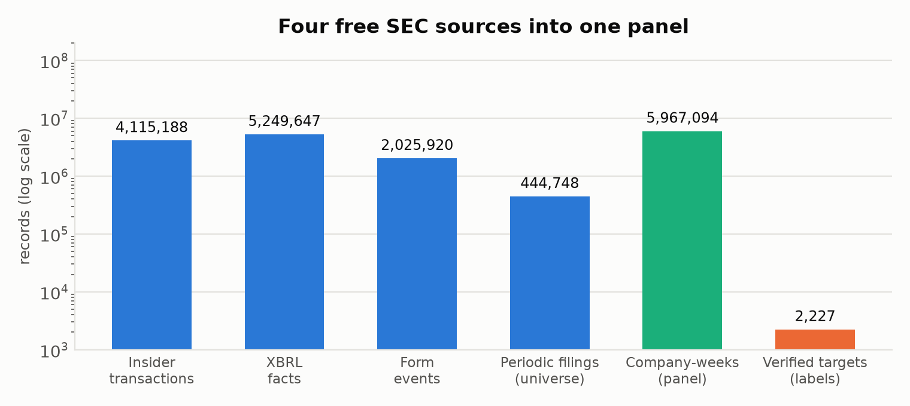

---

## 2. Data

The panel runs from 2012-01-09 to 2026-07-27: **5,967,094 company-weeks**
across **19,021 companies**, one row per listed company per week
[`deal.duckdb`].

Four free sources feed it. 444,748 periodic filings from the EDGAR quarterly
master indexes define the universe [`logs/index.log`]. 4,115,188 Form 4 insider
transactions, 5,249,647 XBRL fundamental facts, and 2,025,920 form events
supply the features. Labels come from DEFM14A merger proxies — with a
qualification large enough to need its own section below.

**Why the panel starts in 2012 and not earlier.** The binding constraint is
XBRL phase-in, not data availability: the EDGAR indexes reach back to 1993 and
the DERA financial-statement sets nominally to 2009Q2, but 2010Q1 is a 5.3 MB
file against 2012Q1's 85.5 MB, and `dei:EntityPublicFloat` covers 702 companies
in CY2009 against 4,834 by CY2011. Small filers were not required to tag until
2011, so an earlier start buys years whose coverage is biased toward large
companies — which would land directly on `log_assets`, one of the model's
strongest features. From 2012 the coverage is clean and in fact better than the
middle of the panel: 87.9% XBRL-assets coverage in 2012 against 79.5% in 2017.

Two construction choices matter more than the feature engineering.

**Survivorship.** The universe is derived from filing activity, not index
membership. A company is listed in quarter Q if it filed a 10-K, 10-Q, 20-F or
40-F in Q. Acquired and delisted companies therefore stay in the panel for
exactly the weeks they existed. Building the universe from a current index
would delete the outcome being modelled — the positives are precisely the
companies that leave.

**The lookahead firewall.** One module (`src/deal/features.py`) may join
anything onto a panel row, and every join is an ASOF join on
`public_ts <= week`. A fact is visible in week *t* only if it was public on or
before that Monday. One rule, one place, one thing to test. Per-company
z-scores and 26-week deltas use only trailing windows inside a company's own
history; the peer-deal window ends one week back so a company's own deal cannot
enter its own feature.

A note on counting. Earlier versions of the README described the pipeline as
turning "11,591,580 EDGAR filing records" into the panel. That figure counted
every row of every master index, most of them forms the pipeline never opens.
The figures above count records actually read into a table.

---

## 3. Method

The framing is a discrete-time hazard model: one row per company-week, label =
"acquired within 52 weeks." Censoring is encoded structurally — a company
simply has no rows after it delists — rather than through a correction term.

**Why trees, not logit.** The relationship between size and acquisition is
hump-shaped. Deal rate by public-float decile runs 0.44% at the smallest, peaks
at 3.98% in the fifth, and falls to 1.03% at the largest
[`curve_clean.json`]. A linear coefficient on size has to choose a direction,
and choosing "bigger" ranks mega-caps first — the decile least likely to be
acquired.

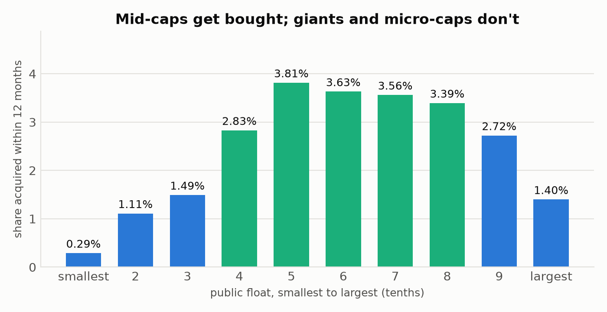

**Evaluation is per-week top-N, not global top-k.** A company contributes
roughly 550 rows to the panel, so a global ranking over company-weeks
collapses: the global top 100 turned out to be three distinct companies, one of
which occupied 84 consecutive weeks. That metric measures a single bet and
reports it as a hundred. Ranking within each week matches how a screen is run.

Splits are temporal or grouped by company, never random over rows. A random row
split puts the same deal on both sides of the boundary — a company's 52-week
label window spans 52 near-identical rows.

---

## 4. The label was wrong

A DEFM14A is filed by whoever's shareholders vote. That is not the same as
"was acquired." In an all-cash deal only the target votes. In a stock deal the
**buyer's** shareholders vote too, because the buyer is issuing shares, so the
acquirer files a merger proxy of its own. Terminated deals leave a proxy behind
with no acquisition at all.

The discriminator needs no new data: a target stops filing periodic reports; an
acquirer does not. Classifying every proxy filer on whether it was still filing
270 days later [`src/deal/clean_labels.py`]:

| Outcome | Count | Share |
|---|---|---|
| Genuine target | 2,227 | 70.1% |
| **Survivor — acquirer or terminated deal** | **749** | **23.6%** |
| Undetermined (too near the panel edge) | 200 | 6.3% |

Teledyne after acquiring FLIR. Newmont after Newcrest. Dow after DowDuPont.
Buyers sitting in a target label set.

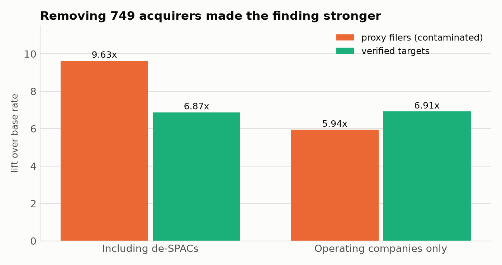

Re-running the identical pipeline on verified targets only:

| | Proxy filers | Verified targets |
|---|---|---|
| All companies | 27.01% / 9.63× | 13.29% / 6.87× |
| **Operating companies** | **13.28% / 5.94×** | **12.28% / 6.91×** |

Precision fell in both universes. Read the base rates before concluding
anything from that: they fell too, because there are now fewer and purer
positives. **Lift — the horizon- and base-invariant figure — rose on operating
companies, 5.94× to 6.91×.** Stripping 23.6% of the positives improved
discrimination, which is the signature of removing noise rather than signal.

The all-companies lift fell hardest, 9.63× to 6.87×, which is what you expect
if acquirer contamination was inflating that number most. Buyers are large and
distinctive, so a model rewarded for spotting them looked better than it was.

**2025 is the weakest year and should not be quoted alone.** The
operating-company score falls to 5.87%, and the year rests on **five distinct
companies**. Two effects compound. Right-censoring truncates the test window at
2025-07-28, leaving about thirty weeks rather than fifty-two. And a deal
announced after roughly October 2025 has not had 270 days to demonstrate that
the company stopped filing, so it is marked undetermined and excluded — while
the 2025 test weeks look *forward* into exactly that window, so genuine deals
get labelled zero and the model is penalised for correct predictions.

This is the same error as the right-censoring bug in Section 10, one layer
further out: the first was about outcomes not yet *occurring*, this one is
about outcomes not yet *classifiable*.

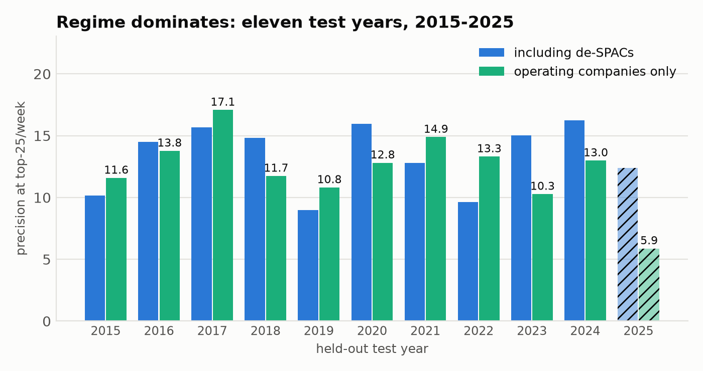

This is the same error as the right-censoring bug in Section 10, one layer
further out: the first was about outcomes not yet *occurring*, this one is
about outcomes not yet *classifiable*.

---

## 5. Results

**Operating companies: 12.28% precision at top-25/week, 6.91× lift**, mean of
eleven held-out years, 2015 through 2025 [`feature_report.json`].

Including de-SPACs the same pipeline gives 13.29% and 6.87×. Both are reported,
but they answer different questions, and only one is a prediction — a
blank-cheque vehicle merging is the thing it was incorporated to do. On clean
labels the two universes nearly converge, and **on lift they are
indistinguishable: +0.04× for excluding SPACs.** Under contaminated labels the
SPAC-inclusive number was inflated to nearly double the operating-company one;
most of that gap was acquirers, not shells. An earlier draft of this repo's
README said excluding SPACs "costs about a third of the apparent skill." It
costs about one point of precision and no measurable lift.

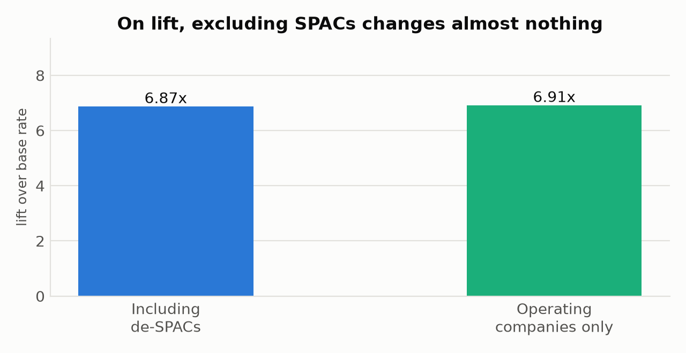

The precision curve declines monotonically. Both models, eleven years,
operating companies [`curve_final.json`]:

| Flagged per week | Target precision | Target lift | Buyer precision | Buyer lift |
|---|---|---|---|---|
| 10 | 15.33% | 8.67× | 35.65% | 14.22× |
| **25** | **12.65%** | **7.14×** | **31.67%** | **12.29×** |
| 50 | 10.47% | 5.91× | 27.69% | 10.62× |
| 100 | 9.04% | 5.12× | 25.51% | 9.76× |
| 200 | 7.87% | 4.44× | 21.75% | 8.38× |

*Base rates 1.77% and 2.62%. Single seed, so these sit within noise of the
two-seed headline.*

**Read year-on-year movement as lift, never precision.** Deal rates are not
stationary: the buyer base rate fell from 3.22% in 2015–19 to 1.87% in 2022–25,
which drags precision down 14 points while lift moves +0.57×. Precision falling
because deals became rarer is not a model getting worse, and an earlier version
of this analysis mistook one for the other.

| | 2015–19 | 2022–25 | Change |
|---|---|---|---|
| Target lift | 6.78× | 6.85× | +0.07× |
| Buyer lift | 11.88× | 12.45× | +0.57× |

**Every precision figure now carries `distinct_hits`** — the number of separate
companies behind it — because a result resting on very few companies looks
identical to a real one in every other statistic. At top-25 the target model's
hits span 18 distinct companies per year on average; the 2025 figure spans five,
which is why that year is not quotable on its own.

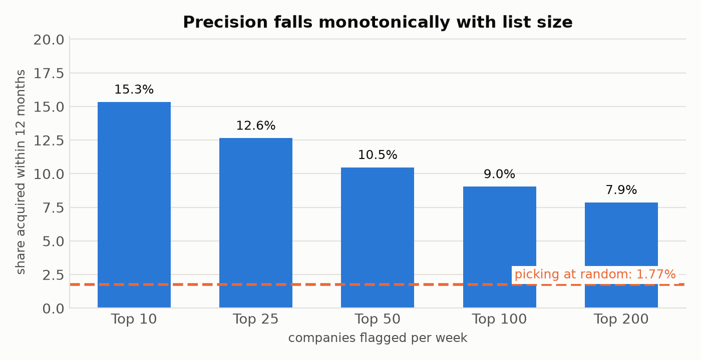

---

## 6. What carries information

A LightGBM gain ranking and a clustered-SE hazard model disagree almost
completely on this panel, and the disagreement is the most useful thing here.

The hazard model is a logit on **1,512,368 rows**, standard errors clustered by
company, on verified-target labels [`stress_pairs.json`]. Clustering is not
optional: naive standard errors measured roughly 4× too small, because a
company's 550 rows are not 550 independent observations. **Twenty** non-control
signals clear |z| > 1.96.

This is the part of the paper that held up best. Where the family-level
ablation reshuffled substantially between panels, the coefficient signs and the
ordering of the strongest signals did not move.

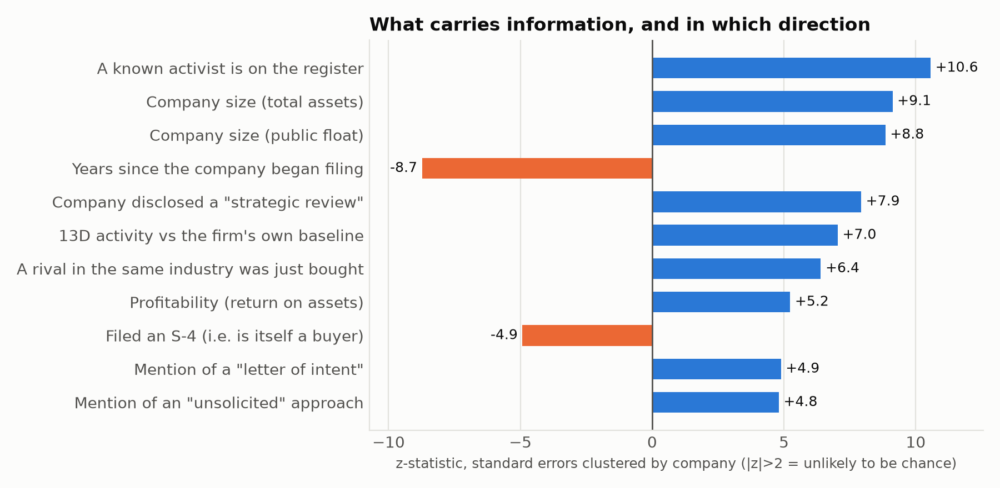

| Signal | β | z |
|---|---|---|
| `activist_recent` | +0.59 | **+10.56** |
| `log_assets` | +0.05 | +9.12 |
| `log_float` | +0.04 | +8.85 |
| `age_weeks` | −0.00 | −8.73 |
| `sa_review_52w` — "strategic alternatives" | +0.07 | +7.93 |
| `sc13d_52w_z` — 13D activity vs own baseline | +0.15 | +7.04 |
| `peer_deal_13w` | +0.04 | +6.40 |
| `roa` | +0.39 | +5.24 |
| `s4_52w` | −0.20 | −4.92 |
| `sa_loi_52w` — "letter of intent" | +0.05 | +4.89 |
| `sa_unsolicited_52w` | +0.09 | +4.81 |
| `sector_deal_intensity` | +0.01 | +4.70 |
| `disc_blackout` — insider silence | +0.45 | +4.55 |
| `i_auditor_change_52w` | −0.33 | −4.40 |
| `cash_runway` | +0.03 | +4.23 |

`s4_52w` is worth reading twice. Filing an S-4 means issuing stock to buy
something, and once buyers are removed from the positive class it predicts
**not** being acquired, at z = −4.92. That is the label fix showing up as
internal coherence rather than as a number moving.

The contrast with the ablation table is the useful part of this section. A
clustered logit on 1.5M rows says twenty signals are individually
distinguishable from zero with high confidence; a paired leave-one-family-out
says almost no *family* is worth more than two points. Both are true. Individual
coefficients being reliably non-zero and feature groups being individually
dispensable are compatible when the signal is spread thin and heavily
correlated across sources — which is the paper's central finding.

### Leave-one-family-out, eleven years, paired

Twelve families, each removed in turn, each fold compared against the same
year's full-feature score. Pairing matters: regime variance (SD ≈ 2.7 points
across years) is the largest term here and cancels when the comparison is
within-year, so the standard error of the *difference* is far smaller than the
spread of either level.

| Family removed | Contributes | ± SE | Years | |
|---|---|---|---|---|
| market | **+2.83** | 0.84 | 9/11 | ✓ |
| fundamentals | **+2.60** | 0.92 | 8/11 | ✓ |
| activist + peer | **+1.95** | 0.82 | 8/11 | ✓ |
| 8-K items | **+1.93** | 0.89 | 8/11 | ✓ |
| deltas | **+1.79** | 0.76 | 9/11 | ✓ |
| insider | +1.53 | 0.77 | 8/11 | |
| strategic text | +1.49 | 0.75 | **10/11** | |
| cert transparency | +1.34 | 0.85 | 8/11 | |
| form counts | +1.28 | 0.99 | 7/11 | |
| z-scores | +1.01 | 0.82 | 7/11 | |
| literature | +0.95 | 0.71 | 9/11 | |
| context | +0.95 | 1.03 | 6/11 | |

*Baseline 12.65%, 72 features, operating companies. ✓ = clears 2 SE.*

Read the column, not the ordering. Every family contributes, the whole range
spans under two points, and the confidence intervals overlap almost completely.
Twelve tests at a two-SE bar will produce roughly one false positive on their
own. The defensible statement is that **the model has no load-bearing family**,
not that market data beats filing behaviour — the gap between first and last is
smaller than the error on either.

`strategic text` deserves a note despite not clearing the bar: it wins **ten of
eleven years**, the most consistent record in the table, on the smallest effect
size. Consistency and magnitude are different things and a single threshold
hides that.

Now the gain disagreement. `form8k_26w` — raw count of 8-K filings — dominates
the tree's gain ranking, yet its family contributes +1.28 points and does not
clear significance, and in the hazard model it does not clear significance
either. High-cardinality integer counts make attractive split candidates
because they offer many thresholds, not because they carry much independent
information. An earlier draft reported this family at +5.43pp from a single
three-year split and built the paper's title on it.

The mirror image is the EDGAR full-text family. "Strategic alternatives",
"letter of intent" and "unsolicited" sit at z = +5.92, +4.71 and +2.87, and
never appear in the tree's top features by gain. A gain-only reading would have
discarded the one family where a company *states its intent* rather than
leaving a trace to be inferred. Feature importance is a property of the
splitting algorithm, not evidence about mechanism.

Two signals point the unintuitive way. **Changing auditor predicts *not* being
acquired** (z = −4.35), inverting the usual reading of auditor turnover as a
distress marker — a company mid-negotiation does not swap auditors, because the
diligence is already running. **Filing late** also predicts against (z = −2.03).
Targets are companies with their affairs in order, not companies falling apart.

---

## 7. Three negative results

### The takeover literature adds nothing that clears its own error bar

Palepu's growth-resource mismatch, management inefficiency proxy, dividend
payout and free cash flow; Ambrose and Megginson's tangible-asset ratio and
blank-cheque preferred — all reconstructed, all present, all inert. On the
paired eleven-year test the entire literature block contributes **+0.95 ± 0.71
points**, the second-smallest of twelve families and comfortably short of two
standard errors [`feature_report.json`].

An earlier draft put this at +0.08pp from a single three-year split and treated
the precision of that number as meaningful. It was not: the same family
measures +1.28 on one panel and +0.95 on another differing only in a data
repair. The honest claim is directional — the literature variables do not earn
their place — not that the effect is 0.08 rather than 0.95.

The stronger version of the test is to fit the family **alone**. Literature-only
scores 6.56% against the full model's 12.70%, roughly half. So these variables
are not empty; they are redundant with, and weaker than, what the rest of the
feature set already encodes.

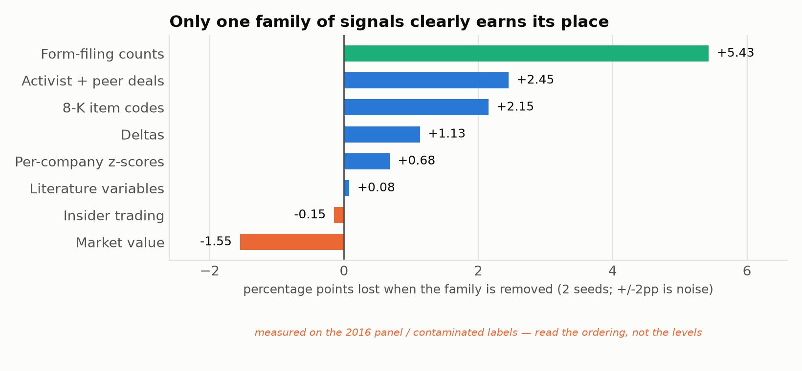

**Palepu's central hypothesis still does not replicate, but the effect is
weaker than the previous draft claimed.** The 1986 argument is that takeovers
discipline inefficient management, so profitability should predict acquisition
*negatively*. Measured on verified targets with company-clustered errors,
return on assets predicts **positively**: β = +0.2609, z = +3.18.

This was the finding most at risk from the label error, because acquirers are
systematically larger and more profitable than targets, so "profitability
predicts acquisition" could have been the model identifying buyers. It is not —
but roughly a third of the z-statistic was, dropping from +4.50 to +3.18. The
supporting cash-flow story does not survive at all: `ocf_to_assets` was
significant at z = −2.07 on contaminated labels and is z = −1.05 on clean ones,
while `fcf_to_assets` sits at +0.40. An earlier planning document read those
two together as a leveraged-buyout screen. There is no such result. What
remains is narrower and still contradicts Palepu: profitable companies get
bought.

The size effect also survives the fix — `log_assets` at z = +8.95, and the
decile hump in Section 3 is measured on clean labels and is more pronounced
than before.

### Sentiment is null

The hypothesis was that hedging language rises in a company's 8-Ks as a deal
approaches. 3,101 documents from 273 companies scored on the
Loughran-McDonald dictionaries — 160 acquired companies matched to controls in
the same 2-digit SIC, each control assigned its match's event date so both
sides face the same calendar window [`lm_scores.parquet`].

At six months or more before announcement, targets and controls are
indistinguishable on every category:

| Category | Target | Control | p |
|---|---|---|---|
| Hedging | 5.95 | 5.51 | 0.30 |
| Uncertainty | 5.27 | 5.00 | 0.35 |
| Weak modal | 2.12 | 2.06 | 0.76 |
| Negative | 5.45 | 5.28 | 0.51 |
| Litigious | 16.49 | 16.05 | 0.21 |

There *is* a large near-deal effect — hedging runs 9.34 in the final two
quarters against 5.69 six months out, p < 0.0001. It is an artifact. Every
category rises together, including `lm_modal_strong` (2.75 near versus 1.38
far, p < 0.0001), which is the opposite of hedging and cannot be explained by
the same story. The driver is document composition: 8-Ks filed near a deal are
**2.03× longer** (1,442 words against 710, p ≈ 2e-25). Longer merger documents
contain more of every word category.

That is the paper's thesis in miniature. A company leaks through the specific
phrase it is obliged to publish — "reviewing strategic alternatives" — and not
through the diffuse tone of the same documents.

### Industry-relative ratios make it worse

The literature reports that industry-adjusted financial ratios beat raw ones.
Reconstructed here, they cost about 1.6 points in both universes
[`ind_all.json`, `ind_nospac.json`].

The original finding is model-class-specific and the caveat did not travel. A
linear model cannot condition on industry any other way, so pre-computing the
deviation is its only route to the interaction. A tree learns it natively from
a SIC split, so pre-computing adds eleven noisy dimensions and no information.

One further null: the Certificate Transparency signal — the idea that a
target's new subdomains leak deal preparation — produced **zero rows**
[`deal.duckdb`]. The feature is constant and gets dropped by the variance
filter. It cost real pipeline code and contributed nothing.

---

## 8. The other side of the trade

The label fix opened a question the paper had not asked: if a merger proxy
identifies buyers as reliably as targets, can the buyer be predicted directly?

Label = files an S-4 within 12 months. An S-4 registers securities issued to
pay for an acquisition, so the filer is a buyer. SPACs excluded, and the three
self-referential features removed — `s4_52w`, `goodwill_to_assets` and
`intangibles_to_assets`, all of which encode *past* acquisitions and would make
the model a trait detector rather than a forecaster [`feature_report.json`].

| Model | Precision | Lift |
|---|---|---|
| Will be acquired (operating companies) | 12.28% | 6.91× |
| **Will buy — S-4 within 12 months** | **31.72%** | **12.21×** |

Both are means of eleven held-out years. The buyer model has also now had the
permutation test the target model always had: refit on labels shuffled within
week, the null tops out at 5.51% against 23.92% real, beating every draw by
more than eighteen points [`stress_pairs.json`].

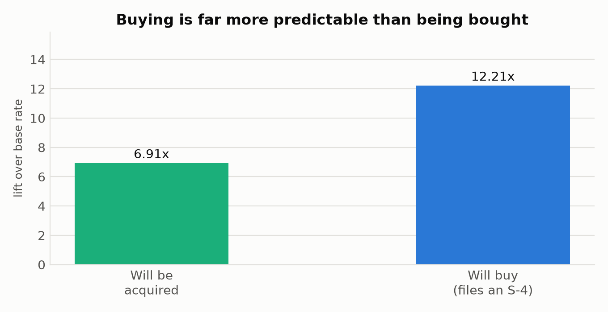

**Acquiring is a strategy; being acquired is an event.** Seacoast Banking filed
32 merger registrations over the panel and Glacier Bancorp 22. Firms like that
buy continuously, and persistent behaviour is far easier to forecast than a
one-time occurrence that depends on another party's decision. The asymmetry is
itself the finding, and it reframes the project: there are two models here, and
the interesting one is the harder one. A 12× buyer lift is substantially
"regional banks keep buying regional banks." A 6.91× target lift is a genuinely
difficult prediction.

**The buyer model has no significant features at family level at all.** Run
through the same paired eleven-year leave-one-out test, not one of thirteen
families clears two standard errors, and the signs split seven positive to six
negative — the pattern of noise:

| | Range | Significant |
|---|---|---|
| Target model | +0.95 to +2.83 | 5 of 12 |
| **Buyer model** | **−3.04 to +2.43** | **0 of 13** |

Two intermediate results are withdrawn here rather than reported. On a
three-year window the buyer model appeared badly over-parameterised — twelve of
thirteen families harmful, sign test p = 0.0017 — and on an eleven-year window
of the pre-repair panel, four families appeared significantly harmful, with
`context` alone worth +4.38 points to remove. Neither survives the data repair.
`context` moves from −4.38 to +0.09. The recommendation those results implied,
pruning the buyer feature set, has no support.

The `buyer capacity` family — shelf registrations, prospectus supplements, dry
powder, debt headroom — was purpose-built for this model and contributes
+0.17 ± 1.05. It is the clearest instance in the project of features designed
from a plausible mechanism that the data does not reward.

---

## 9. How much of this is real

**Levels in this section were measured on contaminated labels and the 2016
panel, and have not been re-derived.** Given the direction of both corrections
— lift up, base rate down, four more test years — the qualitative conclusions
should hold and the levels should not be quoted. Listed so the gap is visible
rather than implied. The two tests that *have* been re-run on verified labels
and the full panel are the buyer permutation and the clustered hazard model,
both reported below and in Section 6.

### Permutation

Refit on labels shuffled within week, preserving each week's positive count and
destroying only the feature-label link. Real 21.40% against a null whose
maximum across draws is 5.89% [`stress_results.json`]. Every null draw is
beaten. The reported p = 0.0476 is the floor attainable with 20 permutations
(1/21) and should be read as "the test could not resolve finer."

**The buyer model has now had the same test, which it never had before.** Real
23.92% against six nulls topping out at 5.51% — beaten by more than eighteen
points [`stress_pairs.json`]. Whatever the buyer model is doing, it is not
leaking.

### Embargo — and a correction to this repo's README

This is the leakage test that matters, because a DEFM14A is filed well after a
deal becomes public. Measured directly on the pair table (Section 2), the gap
from the first 425 or SC TO-T to the merger proxy has a **median of 84 days**
(p25 57, p75 120). If the model were reading
post-announcement filings, blanking the weeks before the proxy would destroy
it.

The README says performance is "flat" under 8- and 16-week embargoes. That is
not what was measured. Precision goes 20.02% → 14.31% → 14.46%. The step from
no embargo to 8 weeks costs 5.7 points, about 28% of the edge.

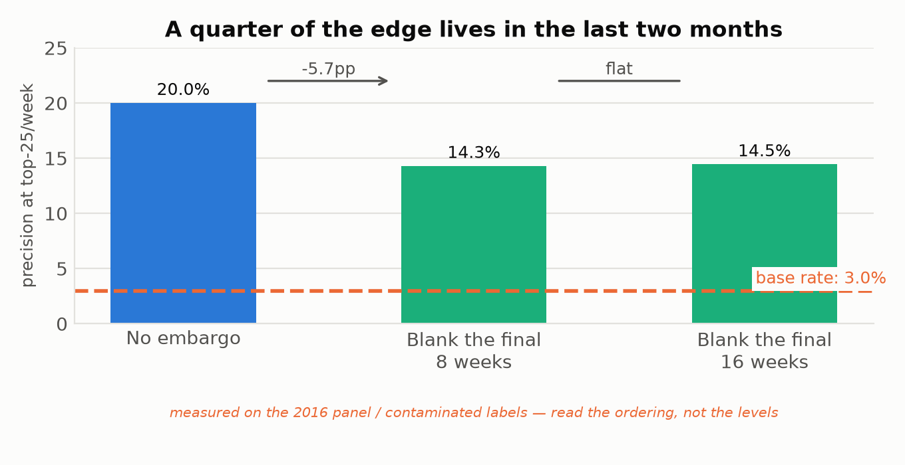

The correct reading is more interesting than the claimed one. A quarter of the
edge does live in the final two months, which is exactly where genuine
pre-announcement preparation shows up — the proxy being drafted, the insider
window closing, the strategic review disclosed. What rules out leakage is the
**second** step: performance is flat from 8 to 16 weeks. If the model were
reading announcement residue, precision would keep collapsing as the window
moved back. It does not.

### Everything else

| Test | Result |
|---|---|
| Seed stability, 5 seeds | 22.34% ± 1.19, SD/mean 0.053 |
| Rolling-origin folds, 4 cutoffs | 35.72% ± 4.24, SD/mean 0.119 |
| Bootstrap CI, 500 draws over weeks | [23.23%, 32.51%] |
| Nested increment | controls 16.03% → +novel 19.64% (+22.6% rel.) |
| Company-level rather than row-level | 23.78% vs 23.02% row-level, 143 companies |
| Data audit | no duplicate rows, no nulls or infinities, no label at or after its own announcement |

Train precision is 76.39% against 23.02% on test. `min_data_in_leaf` is 500
specifically because a company's ~550 near-identical rows let a leaf memorise
one firm, and that gap is what remains after the constraint. It is the reason
nothing here is quoted from an in-sample fit.

### The shells were doing more work than anyone noticed

Cutting the feature set from 72 to 37 costs almost nothing when de-SPACs are in
the universe (27.6% → 26.3%) and nearly half when they are not (13.8% → 7.7%).

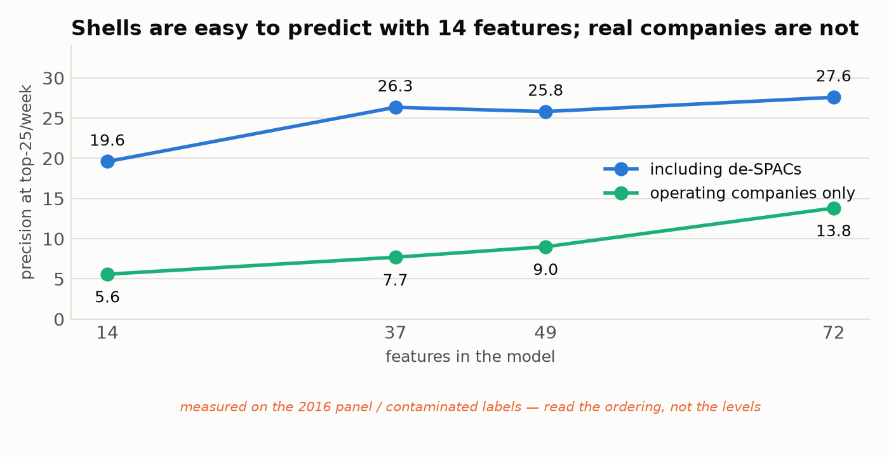

Fourteen features get most of the way on the contaminated SPAC-inclusive
universe and nowhere at all on operating companies. Any evaluation run on the
contaminated universe would have concluded the feature engineering was
unnecessary. It was necessary; the universe was hiding it.

---

## 10. Errors, and what each cost

| Error | Effect if it had gone unnoticed |
|---|---|
| **DEFM14A filers are not all targets — 23.6% were acquirers** | **inflated all-companies lift by 36%; corrupted the ROA finding** |
| **Three-year windows treated as sufficient to compare configurations** | **produced the paper's original thesis, its SPAC claim, and a buyer over-parameterisation result — none replicated at eleven years** |
| **A precision number resting on one company** | the tender-offer validation showed 3.37× lift with a tight CI from **one company held 23 consecutive weeks**; now guarded by `distinct_hits` |
| **Comparing precision across years while the base rate moved** | read a 42% fall in the buyer deal rate as the model decaying; lift was flat |
| Right-censoring: the final 52 weeks cannot have observed outcomes | understated precision by 7.87pp |
| Global top-k measured 3 distinct companies, not 100 | the headline metric would have been meaningless |
| SPAC contamination | believed to cost "a third of the apparent skill"; measured at ~1pp of precision and ~0 lift |
| DEFM14A is dated a median 84 days after announcement | undetected post-announcement leakage |
| **Two loaders silently not re-run during the panel extension** | left 7 of 72 features empty for 2012–2015, handicapping four test years; caught only by noticing two row counts had not changed |

Two more belong on the list and both are this repo's own.

**The 27.52% headline was retracted** because its test period was also used for
early stopping, and it survived in `docs/FINAL_RESULTS.md` and five committed
figures long after the retraction.

**The size-hump figure was captioned with the wrong horizon.** It read `y`
directly from `features.parquet`, which stores a **26-week** label — 1.413%
positive, against 2.769% at 52 weeks — and described it as "within 12 months."
Every model script calls `relabel(raw, 52)` before fitting, so only the figure
was affected. It has been rebuilt at the right horizon on clean labels.

Four of these are label-definition errors and four are *measurement-design*
errors — too few test years, an unguarded metric, an uncontrolled base rate, a
silently incomplete rebuild. Not one is a modelling error. No hyperparameter,
objective function or architecture choice appears on this list, and that ratio
is the practical lesson of the project: on this kind of problem the model is
rarely what is wrong.

---

## 11. Limitations

The screen is wrong about 89% of the time on any individual company. It narrows
seven thousand companies to twenty-five worth reading about, and that is the
whole claim.

**No returns.** No free source retains price history for delisted companies,
which is exactly where the positive observations live, so economic significance
is untested. Palepu's other finding — that takeover-prediction models identify
targets without earning abnormal returns — stands unchallenged here. The
40-to-70-day proxy lag means the announcement move is long gone by the time the
label exists.

**Labels omit tender offers.** DEFM14A requires a shareholder vote; tender
offers do not have one, so roughly 27% of deals are missing, non-randomly —
hostile and all-cash deals skew that way. An earlier external check trained on
merger proxies and evaluated on 1,226 tender offers gave 3.61× lift on
companies never seen as positives, far below the native-label figure. That
check predates the label fix and needs re-running, but its conclusion is
directionally safe: the signal transfers, the magnitude does not. The
defensible claim is "predicts negotiated mergers well and tender offers
weakly", not "predicts M&A".

**Two clean test years.** Dropping 2025 leaves 2023 and 2024, and the spread
between them (9.73% to 11.74%) is wide enough that neither should be quoted
alone. A third clean year arrives once 2025's deals age past the 270-day
classification window.

**Rumour dates are unmeasured**, so lead time is measured against the proxy
filing rather than the first public report.

---

## 12. Reproducing this

Every input is free and public. No CRSP, no Compustat, no SDC Platinum.

```bash
python -m venv .venv && .venv/bin/pip install -e .
export EDGAR_UA="your-project your.email@example.com"   # the SEC requires it
make all      # ~4 hours, ~9 GB, mostly SEC rate limiting
make paper    # regenerate every figure
make test
```

`make all` is resumable — every download is content-addressed to disk, so an
interrupted run picks up where it stopped and a re-run makes zero requests.

---

## References

Ambrose, Brent W., and William L. Megginson. 1992. "The Role of Asset Structure,
Ownership Structure, and Takeover Defenses in Determining Acquisition
Likelihood." *Journal of Financial and Quantitative Analysis* 27 (4): 575–589.

Loughran, Tim, and Bill McDonald. 2011. "When Is a Liability Not a Liability?
Textual Analysis, Dictionaries, and 10-Ks." *Journal of Finance* 66 (1): 35–65.

Palepu, Krishna G. 1986. "Predicting Takeover Targets: A Methodological and
Empirical Analysis." *Journal of Accounting and Economics* 8 (1): 3–35.
