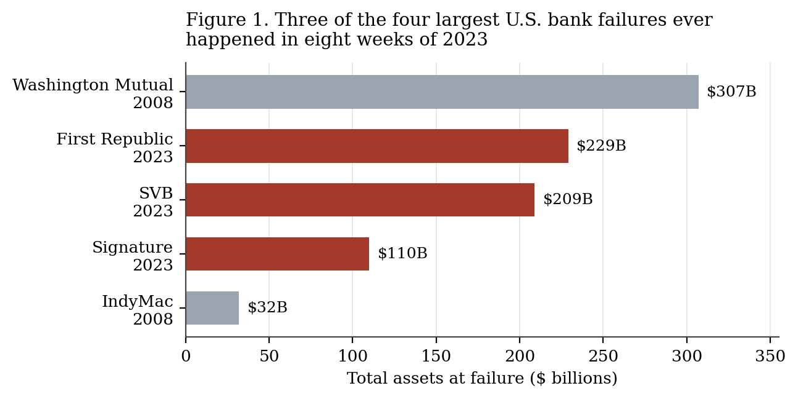
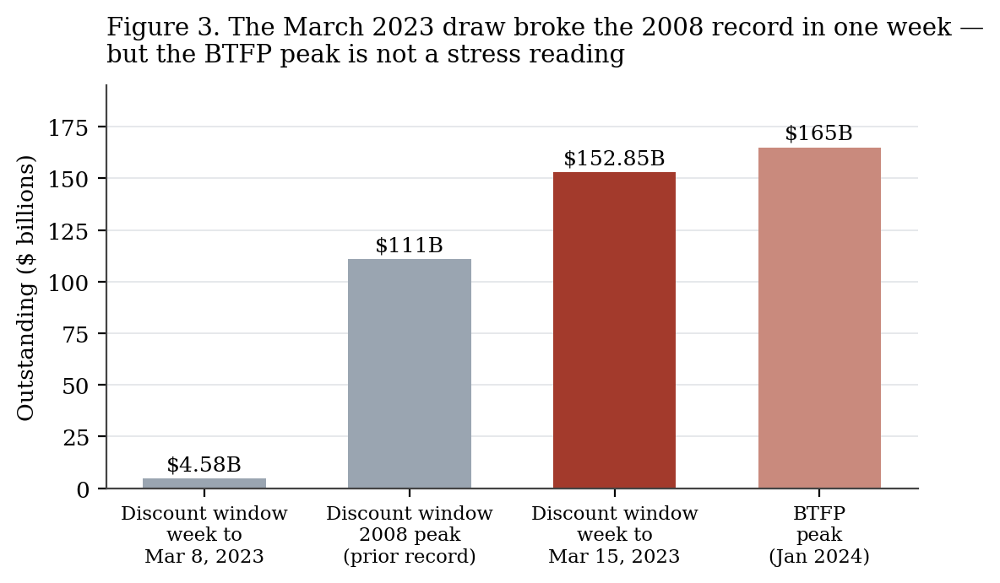
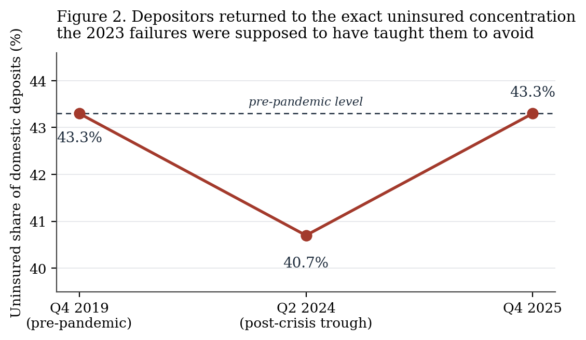

# Bought, Not Restored

### Regional Bank Deposit Stability After Silicon Valley Bank, 2023–2026

*Undergraduate finance seminar · Chicago author-date · ~2,050 words*

---

In roughly eight hours on March 9, 2023, Silicon Valley Bank received requests to withdraw about $42 billion — close to a quarter of its deposit base — and closed the day with a negative cash balance of some $958 million (DFPI 2023a). California's Department of Financial Protection and Innovation took possession before 9 a.m. the next morning and handed the bank to the FDIC (DFPI 2023b). Signature Bank went two days later. First Republic lasted until May 1. Three of the four largest bank failures in American history happened inside eight weeks (Figure 1).

The story that hardened around those weeks is a story about panic and its cure: uninsured depositors ran, the Federal Reserve opened a new facility, confidence returned, regional banking stabilized. Each clause is defensible on its own. Together they describe something that did not happen. Deposit stability was not restored after March 2023 — it was purchased, and the two things behave very differently under stress. It was bought with a permanent repricing of bank funding and with an unlegislated extension of deposit insurance past its statutory limit. The clearest evidence sits in a single series: by the end of 2025, uninsured deposits were back to 43.3 percent of domestic deposits, the identical share they held in the fourth quarter of 2019 (St. Louis Fed 2026). Depositors unlearned the lesson completely. That is not what a repaired system looks like. It is what an insured one looks like.

**Table 1. The 2023 failures**

| Bank | Date | Assets | Deposits | Uninsured share | Resolution |
|---|---|---|---|---|---|
| Silicon Valley Bank | Mar 10, 2023 | ~$209B | ~$175B (12/31/22) | ~86% ($151B) | FDIC receivership; systemic risk exception |
| Signature Bank | Mar 12, 2023 | ~$110B | — | high (crypto/CRE concentration) | FDIC receivership; systemic risk exception |
| First Republic | May 1, 2023 | $229B | ~$92B at sale | high | Sold to JPMorgan Chase |

*Sources: FDIC receivership data; DFPI 2023a; CNBC 2023. Second-largest failure ever, after Washington Mutual ($307B, 2008).*

## The number everyone quoted was the wrong number

The most-cited academic finding of the episode came from Jiang, Matvos, Piskorski, and Seru (2024), who marked U.S. bank assets to market from Q1 2022 through Q1 2023 and found an aggregate decline of $2.2 trillion — roughly 10 percent of asset value, and on the order of the entire capital base of the banking system. Around 500 banks, about 10 percent of the industry, carried larger unrecognized losses than SVB did.

That last statistic escaped into the financial press and became the crisis's shorthand: hundreds of SVBs, waiting. It was the wrong thing to take from the paper. The authors' own model says the binding constraint is not the loss itself but the interaction of the loss with *uninsured leverage* — the share of funding that can leave in an afternoon. Losses on held-to-maturity Treasuries do not kill a bank. Losses plus a depositor base that is 86 percent uninsured, concentrated in one industry, advised by a handful of venture firms who can coordinate an exit over a group chat — that kills a bank. The distinction matters because the two readings imply opposite policy. If the problem is unrealized losses, you fix accounting and capital. If the problem is uninsured concentration, you fix insurance and funding structure. Regulators mostly did neither, and the subsequent record vindicates the second reading: FDIC-reported unrealized losses stayed above $500 billion into 2024 and only fell to $306.1 billion by the fourth quarter of 2025 (FDIC 2026), yet no bank failed because of them. The losses were never the trigger.

The same overcorrection happened with the "first Twitter run" framing. Speed was genuinely new — $42 billion in a business day is not a 1930s bank line — but speed is a proximate cause, and treating it as the root cause produced remedies aimed at communication rather than at balance sheets. SVB's depositors did not run because information moved fast. They ran because they were homogeneous, unprotected, and correct.

## The deposits came back. They just cost more.

Money did leave the banking system, and at a scale without modern precedent. Domestic deposits at FDIC-insured institutions fell 4.8 percent in the year to June 2023, the first annual decline since 1995 and the largest quarterly drop since the FDIC began collecting the series in 1984 (FDIC 2024). The composition of that outflow is the interesting part. In the first quarter of 2023, uninsured depositors withdrew $663 billion while insured deposits *rose* $255 billion. Depositors were not fleeing banks. They were fleeing the uninsured tranche and, in large volume, fleeing zero-rate deposits for money market funds paying something close to the policy rate. Fund assets, under $5 trillion in early 2023, hit a record $7.03 trillion by March 2025 and $8.07 trillion by that December (ICI 2025; Crane Data 2025).

None of that migration reversed. What happened instead is that banks paid up to hold what remained, and the industry's income statement absorbed it. By the fourth quarter of 2025, industry net interest margin had reached 3.39 percent, the highest since 2019, and community bank NIM 3.77 percent, the highest since 2018 (FDIC 2026). Read quickly, that looks like full recovery. Read against the funding base it sits on, it reads differently: margins are back because rates on the asset side eventually caught up, not because deposits got cheap again. The franchise that let banks pay near-zero on sticky retail money through 2021 — what Drechsler, Savov, and Schnabl (2021) call the deposit franchise, and treat as a natural hedge against rising rates — was repriced permanently. Depositors learned in 2022 and 2023 that cash has an opportunity cost, and they did not forget.

**Table 2. The flow reversed**

| | Q1 2023 | Q4 2025 |
|---|---|---|
| Domestic deposits | largest quarterly decline since 1984 | +$318.3B (+1.8%) |
| Estimated uninsured deposits | −$663B | +$214.7B |
| Insured deposits | +$255B | — |
| Unrealized losses (AFS + HTM) | $515.5B | $306.1B (−9.2% q/q) |
| Industry NIM | — | 3.39% (highest since 2019) |
| Problem Bank List | — | 60 banks (1.4% of total) |

*Sources: FDIC Quarterly Banking Profile, Q1 2023 and Q4 2025.*

## What the backstop actually did

The Federal Reserve's response is usually scored as a clean success, and the headline liquidity numbers are extraordinary. Discount window borrowing went from $4.58 billion in the week to March 8, 2023 to $152.85 billion in the week to March 15 — past the $111 billion record set in 2008, in seven days (Figure 3). The Bank Term Funding Program, created March 12, eventually extended nearly 9,000 loans to about 1,327 borrowers and peaked above $165 billion (BPI 2025).

That peak is a bad statistic and deserves to be retired. Starting in late November 2023, the BTFP loan rate fell below the interest rate the Fed paid on reserve balances, so a bank could borrow from the facility, leave the proceeds on deposit at its Reserve Bank, and collect the spread — at one point over 60 basis points of free carry (BPI 2025; Wolf Street 2024). Borrowing rose sharply into January 2024 while the banking system was demonstrably calm. On January 24, 2024 the Fed set the loan rate no lower than the rate on reserves and the flow stopped; the program closed to new credit on March 11. The all-time high in a facility built for a run was substantially an arbitrage artifact. Anyone using the BTFP peak as a stress gauge is reading a subsidy as a symptom.

The consequential intervention was not the facility. It was the systemic risk exception invoked for SVB and Signature, which made every uninsured depositor whole. That decision solved the immediate problem and created a durable one: it established that uninsured deposits at a bank large enough to matter are covered in practice, whatever the $250,000 statutory cap says. No statute was changed. No premium was charged for the extension. The FDIC recovered its costs through a $16.3 billion special assessment levied after the fact, which is a bill, not a price — it was set once the loss was known rather than charged in advance against the risk.

Figure 2 shows what depositors concluded. The uninsured ratio fell to 40.7 percent by mid-2024, exactly the caution you would expect from a genuine repricing of counterparty risk, and then climbed all the way back to 43.3 percent by the fourth quarter of 2025 — the pre-pandemic level (St. Louis Fed 2026). In the fourth quarter of 2025 alone, uninsured balances grew $214.7 billion (FDIC 2026). The correction lasted about five quarters.

There is a real counterargument, and it deserves a straight answer rather than a hedge. A rising uninsured share can mean depositors correctly judge that banks are safer now — better liquidity buffers, more conservative duration, supervisors who finally read the interest-rate risk reports. On that reading, Figure 2 is a picture of restored confidence. The problem is that the underlying structural exposure did not change alongside the behavior. Uninsured leverage is what Jiang et al. identify as the fragility variable, and it is back at 2019 levels while the deposit franchise itself has become more rate-sensitive than it was in 2019. Drechsler, Savov, and Schnabl (2025) sharpen this in later work: the deposit franchise that hedges interest rate risk is itself runnable when it is uninsured, and the run becomes *more* attractive as rates rise, because that is precisely when the franchise is worth most. Confidence at 43.3 percent uninsured is only correct if the guarantee holds. Which returns the question to whether the guarantee is real, and nobody has tested it.

## October 2025 tested the wrong thing

The best natural experiment so far arrived on October 16, 2025, when Zions Bancorporation disclosed apparent misrepresentation and default on two related commercial loans totaling roughly $60 million at its California Bank & Trust unit, charging off $50 million. Western Alliance disclosed a related revolving facility to Cantor Group V LLC, against which it had already sued for fraud in August. Zions fell 13.1 percent and Western Alliance 10.8 percent; the S&P Regional Banks Select Industry Index dropped 6.3 percent, its worst day since April 2025 (Reuters 2025; Bloomberg 2025).

A $50 million charge-off at a bank with roughly $90 billion in assets is a rounding error. The market treated it as a signal about regional bank credit generally, and that reaction is usually read as evidence of lingering post-SVB fragility. It is better read as the opposite. Nothing in October 2025 was about deposits. Equity holders repriced credit risk violently and depositors did not move, which is exactly the behavior a credible guarantee produces: the residual claimant absorbs the fear, the funding base sits still. The fragility did not go away. It relocated, from the liability side to the asset side, from depositors to shareholders — and the transfer happened because one of those two groups now believes it is insured.

Three years of evidence, then, point one way. Deposit betas reset permanently. Cash migrated to money funds and stayed. Margins recovered on the asset side rather than the funding side. And uninsured concentration completed a full round trip. The system that emerged is more expensive to fund than the one that failed in 2023 and no less exposed to the thing that made SVB fatal, held together by a commitment that exists only as precedent.

Which is where the account should end, because the open question is uncomfortable. The March 2023 exception was extended to two banks whose depositors were politically legible — venture-backed startups, payroll accounts, a technology sector with immediate access to Washington. The Deposit Insurance Fund is not capitalized for a systemic exception, and no premium has ever been collected for one. So the guarantee that 43.3 percent of domestic deposits currently rests on is not a rule. It is a prediction about who gets rescued, made by depositors who have never watched the government decline.

---

## References

Bank Policy Institute (BPI). 2025. "Bank Term Funding Program: Experience and Lessons Learned." April 1. https://bpi.com/bank-term-funding-program-experience-and-lessons-learned/

Bloomberg. 2025. "Regional Banks Disclose Bad Loans Tied to Alleged Fraud." October 16.

California Department of Financial Protection and Innovation (DFPI). 2023a. "Review of DFPI's Oversight and Regulation of Silicon Valley Bank." May 8. https://dfpi.ca.gov/wp-content/uploads/sites/337/2023/05/Review-of-DFPIs-Oversight-and-Regulation-of-Silicon-Valley-Bank.pdf

———. 2023b. "Order Taking Possession of Property and Business — Silicon Valley Bank." March 10. https://dfpi.ca.gov/wp-content/uploads/sites/337/2023/03/DFPI-Orders-Silicon-Valley-Bank-03102023.pdf

CNBC. 2023. "JPMorgan Chase Takes Over First Republic After Biggest U.S. Bank Failure Since 2008." May 1.

Crane Data. 2025. "Money Fund Assets Break Over $8.0 Trillion as Year-End Surge Continues." December.

Drechsler, Itamar, Alexi Savov, and Philipp Schnabl. 2021. "Banking on Deposits: Maturity Transformation Without Interest Rate Risk." *Journal of Finance* 76 (3): 1091–1143.

———. 2025. "Deposit Franchise Runs." *Journal of Finance*. Also NBER Working Paper 31138. https://www.nber.org/system/files/working_papers/w31138/w31138.pdf

Federal Deposit Insurance Corporation (FDIC). 2023. *Quarterly Banking Profile, First Quarter 2023*. https://www.fdic.gov/news/speeches/2023/spmay3123.html

———. 2024. *Quarterly Banking Profile* and deposit trends analysis, 2023–24. https://www.fdic.gov/analysis/quarterly-banking-profile/fdic-quarterly/2024-vol18-1/article2.pdf

———. 2026. *Quarterly Banking Profile, Fourth Quarter 2025*. February. https://www.fdic.gov/news/speeches/2026/fdic-quarterly-banking-profile-fourth-quarter-2025

Federal Reserve Board. 2023. "Bank Term Funding Program: Terms and Conditions." March 12. https://www.federalreserve.gov/newsevents/pressreleases/files/monetary20230312a1.pdf

Investment Company Institute (ICI). 2025. "Money Market Fund Assets Hit Record-Setting $7 Trillion Mark." March. https://www.ici.org/news-release/money-market-funds-hit-seven-trillion

Jiang, Erica Xuewei, Gregor Matvos, Tomasz Piskorski, and Amit Seru. 2024. "Monetary Tightening and U.S. Bank Fragility in 2023: Mark-to-Market Losses and Uninsured Depositor Runs?" *Journal of Financial Economics* 159. Also NBER Working Paper 31048. https://www.nber.org/papers/w31048

Reuters. 2025. "US Regional Bank Stocks Hit by Zions Charge-off, Fraud Allegations." October 16.

St. Louis Fed. 2026. "Banking Analytics: Uninsured Deposit Ratio Back to Prepandemic Level." *On the Economy*, April. https://www.stlouisfed.org/on-the-economy/2026/apr/banking-analytics-uninsured-deposit-ratio-back-prepandemic-level

Wolf Street. 2024. "'Effective Immediately,' Fed Shuts Down Arbitrage Opportunity with the Bank Term Funding Program." January 24.

---

## Appendix: Pre-writing notes

**Anchors established before drafting.** (1) SVB's March 9, 2023 withdrawal requests of ~$42B in ~8 hours against ~$166B of deposits, closing at −$958M cash. (2) The three 2023 failures by asset size, against the 2008 comparables. (3) Discount window at $152.85B in the week to March 15, 2023 versus $4.58B the week before and a $111B record from 2008; BTFP peak above $165B. (4) FDIC flow data: uninsured −$663B and insured +$255B in Q1 2023; uninsured +$214.7B in Q4 2025. (5) The uninsured deposit ratio round trip: 43.3% (Q4 2019) → 40.7% (Q2 2024) → 43.3% (Q4 2025).

**Thesis.** Deposit stability after March 2023 was purchased rather than restored — paid for with a permanent repricing of bank funding and an unlegislated extension of deposit insurance — and the proof is that uninsured concentration has fully round-tripped to its pre-pandemic level while the sector's one real scare since came from credit, not withdrawals.

**Structures considered.** (A) Chronological, 2023 → 2026: rejected, a timeline is not an argument. (B) Received narrative → correction → what the corrected reading predicts → test against October 2025: rejected as a standalone because the correction section carries too much weight before the reader has a stake. (C) *Selected* — claim first, then the three things that must be true if the claim holds (the funding base repriced, the guarantee shows up in depositor behavior, the next scare comes from somewhere other than deposits), each checked in turn, closing on the unpriced option. The structure follows the logic of the claim rather than a template, and the pushback on Jiang et al. lands early where it does argumentative work.

**Self-review pass.** Checked for and found none of the banned terms. Rewrote two openers that read as corporate throat-clearing ("The banking turmoil of 2023 raised questions about…" and "It is clear that regulators faced…"). Broke up three consecutive paragraphs of near-identical length in the funding section by moving Table 2 and splitting the BTFP arbitrage material into its own short run of sentences. The conclusion introduces the Deposit Insurance Fund's capitalization and the political selection of who gets rescued — neither appears in the opening — so it advances rather than restates.

**Figures.** Generated by `figures.py` in this directory from the sourced values above; no interpolated or modeled data points.
